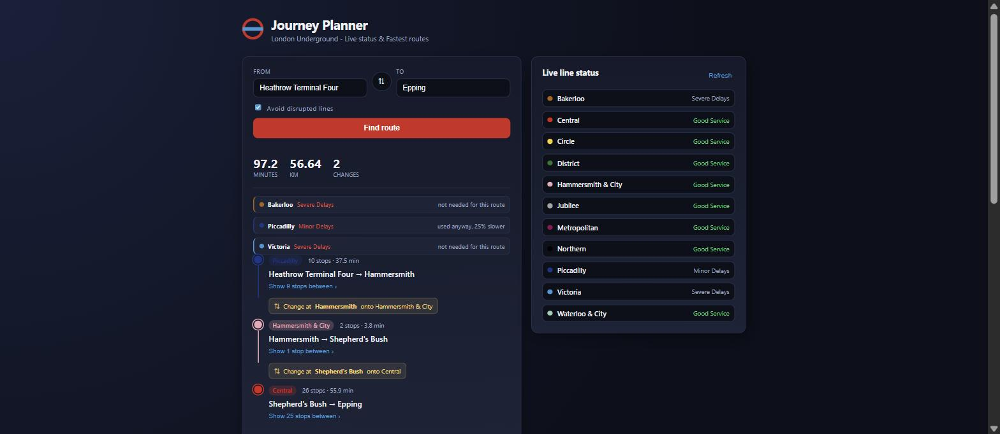
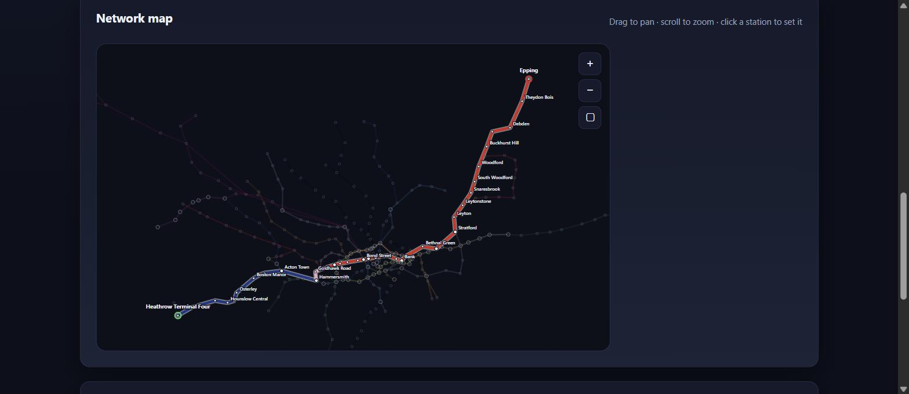
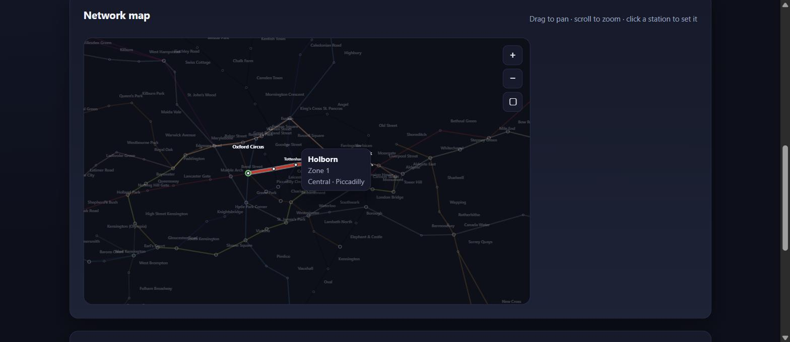

# London Underground Journey Planner

Fastest-route planning across the 271-station Tube network, weighted by live
TfL service data and drawn on an interactive, geographically accurate map.

[](https://github.com/oliver-mills/london-journey-planner/actions/workflows/ci.yml)




---

## What it does

Give it two stations and it finds the genuinely fastest way between them —
counting the time you lose changing lines, and pricing in whatever TfL says is
happening on the network right now.

- **Fastest route, not fewest stops.** A state-space A\* search that charges a
  real penalty for every line change.
- **Live service data as cost, not just a filter.** A severely delayed line is
  made expensive rather than deleted, so it is still used when it remains the
  best option — and the route explains what it did and why.
- **An interactive map of the real network.** Every station at its true
  geographic position, pan and zoom, click two stations to plan between them.
- **Built from a raw spreadsheet.** An ETL step normalises inconsistent source
  data into a clean undirected graph, and a second enriches it with coordinates
  and fare zones from the TfL API.

## Try it

```bash
git clone https://github.com/oliver-mills/london-journey-planner.git
cd london-journey-planner

python -m venv .venv && source .venv/bin/activate   # Windows: .venv\Scripts\activate
pip install -r requirements.txt

python scripts/build_database.py                    # builds data/tube.db
python -m uvicorn tube_planner.api:app --reload
```

Then open <http://127.0.0.1:8000>.

No API key is needed — the TfL status endpoint works unauthenticated, subject to
a rate limit. Set `TFL_APP_KEY` in a `.env` file to raise it. If TfL is
unreachable the planner falls back to timetable-only routing rather than failing.

---

## The interesting parts

### Routing is a search over (station, line), not over stations

Changing lines costs real time. A search over station nodes alone cannot
represent that, because by the time you arrive at a node you have forgotten
which line you came in on.

Keying each search state on `(station, line_currently_on)` fixes it: the
interchange penalty is charged on exactly the transitions that are real line
changes, and the search can decide that staying on a slower train beats
changing onto a faster one.

### A\* — with an honest benchmark

The heuristic is straight-line distance to the destination divided by the
fastest speed observed anywhere on the network. That is admissible by
construction: nothing on the network travels faster, so the estimate can never
exceed the true remaining time.

Passing no station positions leaves the heuristic at zero — which *is*
Dijkstra. So the benchmark compares one implementation against itself with the
heuristic switched off, rather than two separate searches that might differ for
unrelated reasons.

```
$ python scripts/benchmark_pathfinding.py
271 stations, 2000 random journeys

               states expanded      mean    total time
------------------------------------------------------
Dijkstra               416,201     208.1         0.72s
A*                     280,233     140.1         0.72s
------------------------------------------------------
A* explores 32.7% fewer states and runs -0.1% faster.
All 2000 routes returned identical journey times.
```

**A\* explores a third fewer states but is not faster in wall-clock, and that is
worth stating plainly.** On a graph this small Dijkstra settles only ~208
states, and the per-state cost of computing and carrying a heuristic almost
exactly cancels the 68 states saved.

Getting to parity took two rounds of profiling. Memoising `h(station)` — it was
recomputed once per *incoming edge* rather than once per station — took A\* from
33% slower to 20% slower. Hoisting `max_speed_km_per_min` out of the per-search
path, where it was rescanning all 746 edges on every single call, closed the
rest. The pruning is real and would pay off on a larger graph; at this scale the
constant factor eats it.

### Live disruption is priced in, not switched off

The naive approach is a boolean: line disrupted, line removed. That is wrong in
both directions — it over-reacts to minor delays and it strands stations when a
line is only partly affected.

Instead each TfL severity maps to a travel-time multiplier:

| Severity | Effect |
| --- | --- |
| Suspended, Closed, Planned Closure, Not Running | excluded entirely |
| Part Suspended / Part Closure | ×4.0 / ×3.0 |
| Severe Delays | ×2.5 |
| Reduced Service | ×1.6 |
| Minor Delays | ×1.25 |

`Part Suspended` deliberately degrades rather than blocks: TfL does not say
*which* part is affected, so discarding the whole line strands every station it
still serves and can produce a spurious "no route". A large multiplier means any
working alternative wins, but you still get an answer.

Because multipliers only ever raise costs, the A\* heuristic stays admissible
with them in play. Values below 1.0 are clamped — a line running faster than its
timetable would silently break that guarantee.

The route reports its own reasoning, so the live data is visible rather than a
hidden weight:

- **Bakerloo** · Severe Delays — *not needed for this route*
- **Piccadilly** · Minor Delays — *used anyway, 25% slower*

### An interactive map, with no mapping library



The backend projects every station through Web Mercator into SVG coordinates
and serves the whole network pre-projected, so the frontend needs no knowledge
of map maths and no third-party dependency. London spans enough latitude that a
naive equirectangular plot visibly skews the network, so the projection is worth
doing properly.

Zoom narrows the SVG `viewBox`, which would shrink strokes and station dots
along with the map. A `--zoom` custom property on the `<svg>` divides every line
weight and radius in CSS, holding them visually constant at any zoom.



Central London packs a dozen stations into the space one name needs. Labels are
placed greedily in priority order — stations on the current route, then
interchanges, then everything else — and any that would overlap one already
placed is dropped. Without it the middle of the map is an unreadable smear.

### The data pipeline

The source spreadsheet lists each line as directed rows, one per direction of
travel, with station names split inconsistently across platform and branch
qualifiers. Left alone it produces a subtly broken graph. The most striking
case: `KINGS CROSS` and `KINGS CROSS ST PANCRAS` appear as separate nodes, so no
route could ever change between the Victoria and Circle lines there.

The spreadsheet also has no geography at all, so a second step pulls
coordinates and fare zones from TfL's StopPoint API. Matching the two naming
schemes — "King's Cross St. Pancras Underground Station" against
`KINGS CROSS ST PANCRAS` — gets 256 of 271 stations automatically; the
remaining 15 are a curated alias table covering renamings and closures.
**All 271 stations are located.**

The result is committed to the repo, so builds are reproducible and work
offline.

---

## Architecture

```
data/raw/station_database.xlsx     ─┐
data/raw/station_coordinates.json  ─┴─> scripts/build_database.py ──> data/tube.db
                                                                          │
tube_planner/                                                             ▼
├── graph.py         loads the database into an adjacency list
├── geo.py           Web Mercator projection and haversine distance
├── pathfinding.py   state-space A* with interchange penalties
├── tfl_client.py    live line status, cached, severity to multiplier
├── lines.py         official TfL line colours
├── formatting.py    ALL-CAPS source names to display names
├── reviews.py       SQLite-backed station reviews
└── api.py           FastAPI endpoints and static hosting

web/                 vanilla JS frontend, no build step, no dependencies
```

### API

| Endpoint | Purpose |
| --- | --- |
| `GET /api/stations` | every station, for autocomplete |
| `GET /api/network` | the whole network pre-projected for the map |
| `GET /api/status` | live line status with official colours |
| `POST /api/route` | plan a journey; returns legs, interchanges and disruptions |
| `GET/POST /api/reviews/{station}` | station reviews |

```bash
curl -X POST http://127.0.0.1:8000/api/route \
  -H 'Content-Type: application/json' \
  -d '{"start": "BANK", "end": "BAKER STREET", "avoid_disruptions": true}'
```

## Tests

```bash
pytest -q          # 89 tests
ruff check .
```

The load-bearing test compares A\* against zero-heuristic Dijkstra across **all
1260 ordered pairs** of a geographic grid. An inadmissible heuristic shows up as
a cheaper-but-wrong route, which is precisely the failure mode a hand-written
heuristic risks. Alongside it: direct admissibility checks, proof that A\*
strictly prunes rather than being merely correct-and-useless, the severity
weighting end to end, and graceful degradation when TfL is unreachable.

## Built with

Python 3.11+ · FastAPI · SQLite · openpyxl · vanilla JS and SVG · the
[TfL Unified API](https://api.tfl.gov.uk/)

## Licence

MIT — see [LICENSE](LICENSE).

Not affiliated with Transport for London. Line names and colours are TfL
trademarks, used here to describe their own network.
